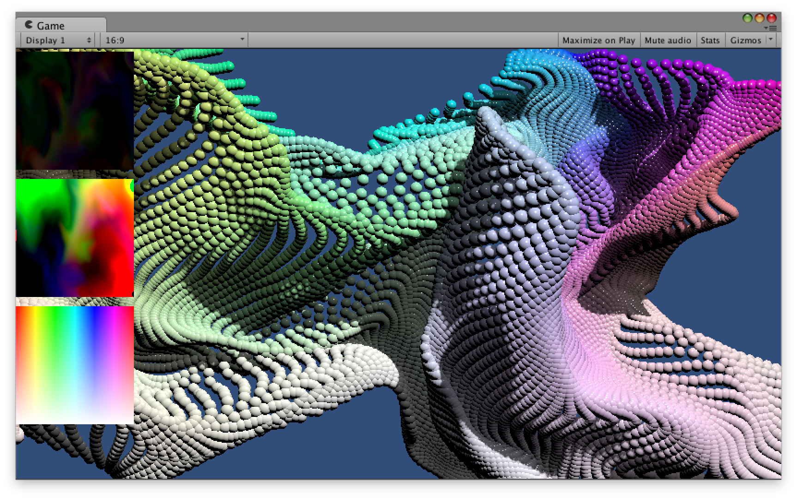
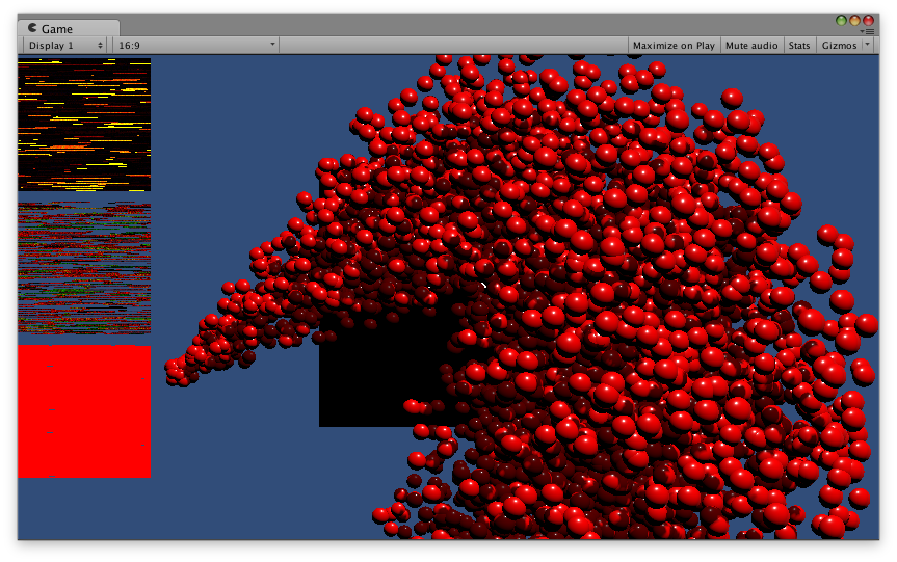
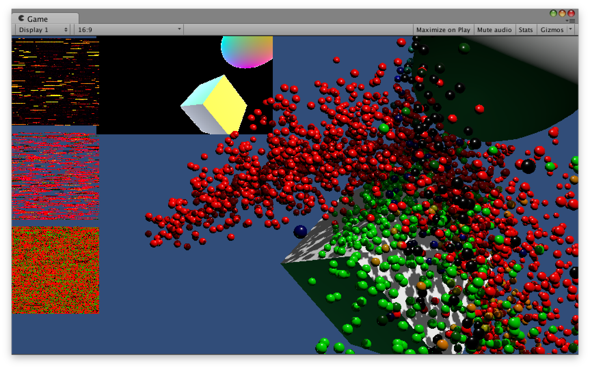

#Unity GPU Particle

Unityによる、GPU Particle Systemです。

RenderTextureに、パーティクルの速度、位置、色情報を格納。

テクスチャは、Shaderにより、アップデートしています。

n*n個のパーティクルをRenderTextureにより制御しています。

Unity標準のParticleSystemと比較し、より多くのParticleを少ない負荷で処理します。

##Images

###CurlNoise
 

###Particle Emitter

###Screen Space Particle Collision

